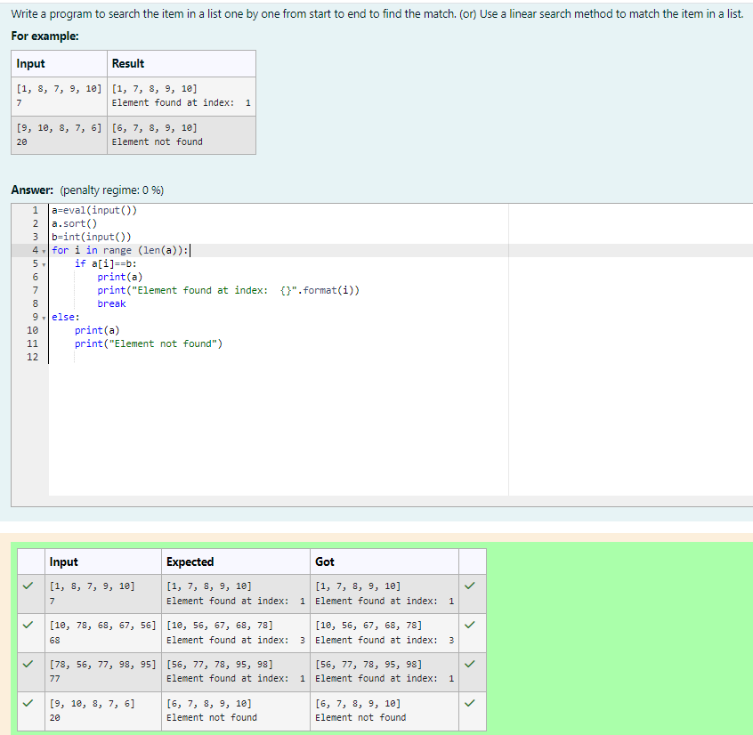
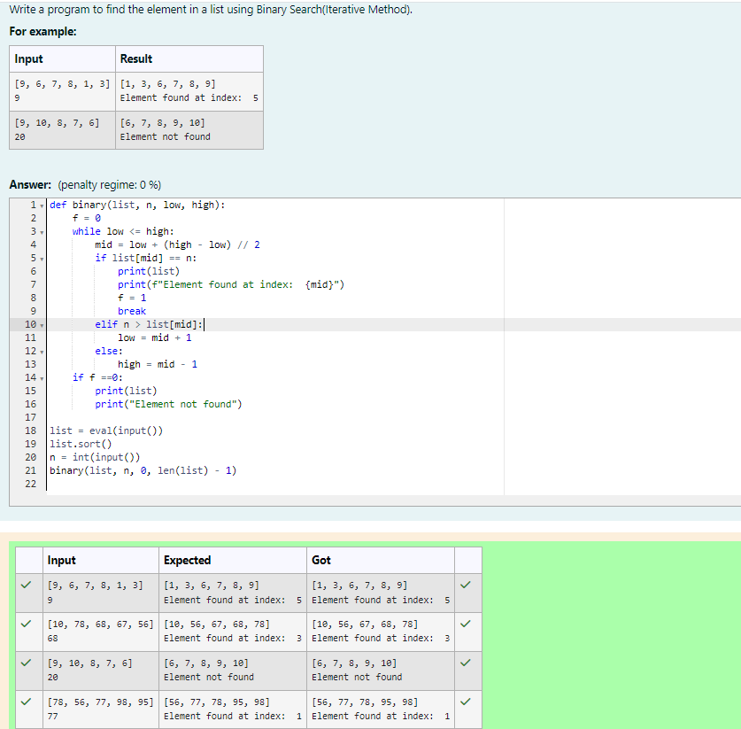
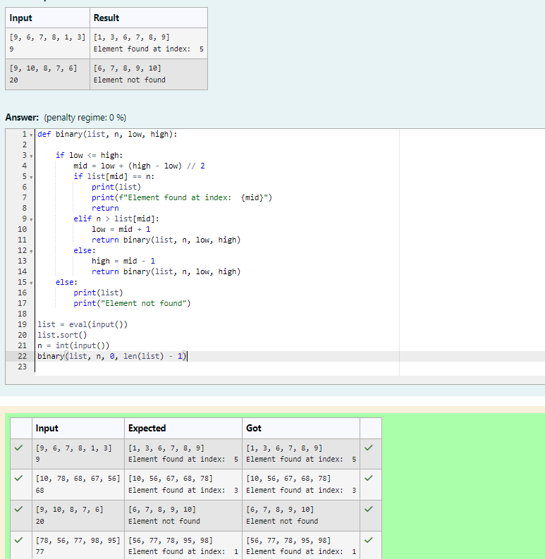

# Linear Search and Binary search
## Aim:
To write a program to perform linear search and binary search using python programming.
## Equipment’s required:
1.	Hardware – PCs
2.	Anaconda – Python 3.7 Installation / Moodle-Code Runner
## Algorithm:
## Linear Search:
1.	Start from the leftmost element of array[] and compare k with each element of array[] one by one.
2.	If k matches with an element in array[] , return the index.
3.	If k doesn’t match with any of elements in array[], return -1 or element not found.
## Binary Search:
1.	Set two pointers low and high at the lowest and the highest positions respectively.
2.	Find the middle element mid of the array ie. arr[(low + high)/2]
3.	If x == mid, then return mid.Else, compare the element to be searched with m.
4.	If x > mid, compare x with the middle element of the elements on the right side of mid. This is done by setting low to low = mid + 1.
5.	Else, compare x with the middle element of the elements on the left side of mid. This is done by setting high to high = mid - 1.
6.	Repeat steps 2 to 5 until low meets high
## Program:
```
Program to perform linear search and binary search using python programming
Developed by: S.Sajetha
Referece number: 212223100049
```
i) Use a linear search method to match the item in a list.
```
a=eval(input())
a.sort()
b=int(input())
for i in range (len(a)):
    if a[i]==b:
        print(a)
        print("Element found at index:  {}".format(i))
        break
else:
    print(a)
    print("Element not found")
```
ii) Find the element in a list using Binary Search(Iterative Method).
```
def binary(list, n, low, high):
    f = 0
    while low <= high:
        mid = low + (high - low) // 2
        if list[mid] == n:
            print(list)
            print(f"Element found at index:  {mid}")
            f = 1
            break
        elif n > list[mid]:
            low = mid + 1
        else:
            high = mid - 1
    if f ==0:
        print(list)
        print("Element not found")

list = eval(input())
list.sort()
n = int(input())
binary(list, n, 0, len(list) - 1)
```
iii) Find the element in a list using Binary Search (recursive Method).
```
def binary(list, n, low, high):
    
    if low <= high:
        mid = low + (high - low) // 2
        if list[mid] == n:
            print(list)
            print(f"Element found at index:  {mid}")
            return 
        elif n > list[mid]:
            low = mid + 1
            return binary(list, n, low, high)
        else:
            high = mid - 1
            return binary(list, n, low, high)
    else:
        print(list)
        print("Element not found")

list = eval(input())
list.sort()
n = int(input())
binary(list, n, 0, len(list) - 1)
```
## Sample Input and Output






## Result
Thus the linear search and binary search algorithm is implemented using python programming.
